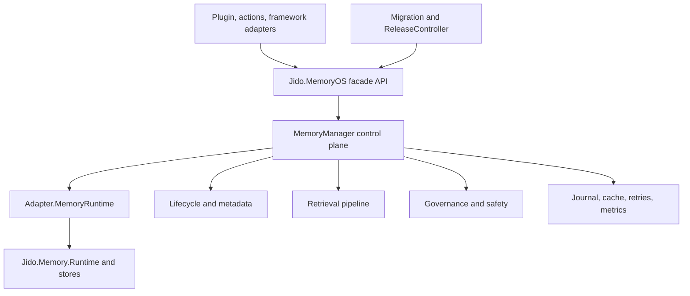

# Jido MemoryOS

MemoryOS is a tiered memory orchestration layer built on top of
[`jido_memory`](https://github.com/agentjido/jido_memory).

## What MemoryOS Is
`Jido.MemoryOS` is a memory operating layer for agents that combines:
- tiered memory (`short`, `mid`, `long`)
- a control plane for scheduling/retries/idempotency
- explainable retrieval and context packaging
- governance controls (policy, approvals, masking, audit)
- safe migration and rollout from legacy memory paths

The design is aligned with [Memory OS of AI Agent (arXiv:2506.06326)](https://arxiv.org/abs/2506.06326).

## Architecture


## Guides
### User Guides
| # | Guide | Focus |
|---|---|---|
| 1 | [`01 - Purpose, Architecture, and Research`](docs/user/01-purpose-architecture-and-research.md) | What MemoryOS is, why to use it, and research links |
| 2 | [`02 - Installation and Bootstrapping`](docs/user/02-installation-and-bootstrapping.md) | Dependency setup, app config, manager startup |
| 3 | [`03 - Core API and Common Workflows`](docs/user/03-core-api-and-common-workflows.md) | `remember/retrieve/explain/consolidate` usage patterns |
| 4 | [`04 - Retrieval, Ranking, and Explainability`](docs/user/04-retrieval-ranking-and-explainability.md) | Query options, ranking behavior, explain payloads |
| 5 | [`05 - Governance, Safety, and Error Handling`](docs/user/05-governance-safety-and-error-handling.md) | Access policy, approvals, masking, typed errors |
| 6 | [`06 - Jido Plugin, Actions, and Framework Adapters`](docs/user/06-jido-plugin-actions-and-framework-adapters.md) | Agent plugin routes and adapter usage |
| 7 | [`07 - Migration, Rollout, and Operations`](docs/user/07-migration-rollout-and-operations.md) | Backfill, rollout control, ops and benchmarks |

### Developer Guides
| # | Guide | Focus |
|---|---|---|
| 1 | [`01 - Intended Goals and System Architecture`](docs/developer/01-intended-goals-and-system-architecture.md) | Architectural intent and module boundaries |
| 2 | [`02 - Control Plane and Memory Manager Internals`](docs/developer/02-control-plane-and-memory-manager-internals.md) | Queueing, scheduling, retries, idempotency, replay |
| 3 | [`03 - Tiered Data Model and Lifecycle Mechanics`](docs/developer/03-tiered-data-model-and-lifecycle-mechanics.md) | Metadata contract, consolidation, promotion semantics |
| 4 | [`04 - Retrieval and Explainability Pipeline`](docs/developer/04-retrieval-and-explainability-pipeline.md) | Planner/ranker/context-pack internals |
| 5 | [`05 - Governance, Safety, and Observability`](docs/developer/05-governance-safety-and-observability.md) | Policy, approvals, retention/masking, audit surfaces |
| 6 | [`06 - Jido Integration and Extensibility Surfaces`](docs/developer/06-jido-integration-and-extensibility-surfaces.md) | Plugin/action/adapters and extension points |
| 7 | [`07 - Migration, Rollout, and Performance Engineering`](docs/developer/07-migration-rollout-and-performance-engineering.md) | Migration flow, cutover/rollback, SLO benchmarking |

## Status
- All implementation phases in [`notes/planning`](https://github.com/agentjido/jido_memory_os/tree/main/notes/planning) are complete:
  - Phase 1 through Phase 8
  - Cross-phase acceptance scenarios `X-1` through `X-8`
- Integration coverage currently includes:
  - `phase_01_integration_test.exs` through `phase_08_integration_test.exs`
  - `cross_phase_acceptance_test.exs`

## What It Includes
- Core facade API: `Jido.MemoryOS`
  - `remember/3`, `retrieve/3`, `forget/3`, `prune/2`, `consolidate/2`, `explain_retrieval/3`
  - migration helpers: `migrate_legacy/2`, `reconcile_legacy/2`
- Control plane: `Jido.MemoryOS.MemoryManager`
  - queueing/scheduling, retries, throttling, fairness, caching, journaling/replay, idempotency
- Tiered lifecycle: short/mid/long promotion with lineage and conflict handling
- Retrieval pipeline: planner, ranker, context packing, explainability trace
- Governance and safety:
  - access policy enforcement
  - approval tokens
  - audit logging
  - retention enforcement
  - redaction/masking
- Jido integrations:
  - plugin routes (`memory_os.remember|retrieve|forget|consolidate`)
  - action modules
  - framework adapters
- Phase 8 rollout/migration modules:
  - `Jido.MemoryOS.Migration`
  - `Jido.MemoryOS.ReleaseController`

## Quick Start
```elixir
target = %{id: "agent-1", group: "group-alpha"}
opts = [server: Jido.MemoryOS.MemoryManager, actor_id: target.id, actor_group: target.group, target_group: target.group]

{:ok, _record} =
  Jido.MemoryOS.remember(target, %{class: :episodic, kind: :event, text: "user likes concise responses"}, opts)

{:ok, records} =
  Jido.MemoryOS.retrieve(target, %{tier_mode: :hybrid, text_contains: "concise", limit: 5}, opts)

{:ok, explain} =
  Jido.MemoryOS.explain_retrieval(target, %{text_contains: "concise", limit: 5}, opts)
```

## Migration and Rollout
```elixir
# Legacy backfill into MemoryOS tiers
{:ok, report} =
  Jido.MemoryOS.migrate_legacy(target,
    legacy_store: {Jido.Memory.Store.ETS, [table: :jido_memory]},
    server: Jido.MemoryOS.MemoryManager,
    actor_id: target.id
  )

# Optional rollout controller for legacy/dual_run/memory_os modes
{:ok, _pid} =
  Jido.MemoryOS.ReleaseController.start_link(
    name: :memory_os_release,
    mode: :dual_run,
    memory_server: Jido.MemoryOS.MemoryManager
  )
```

## Development
```bash
mix deps.get
mix test
```

## Planning Docs
- Index: [`notes/planning/README.md`](https://github.com/agentjido/jido_memory_os/blob/main/notes/planning/README.md)
- Phase 8 release/runbook governance: [`notes/planning/phase-08-release-governance.md`](https://github.com/agentjido/jido_memory_os/blob/main/notes/planning/phase-08-release-governance.md)
