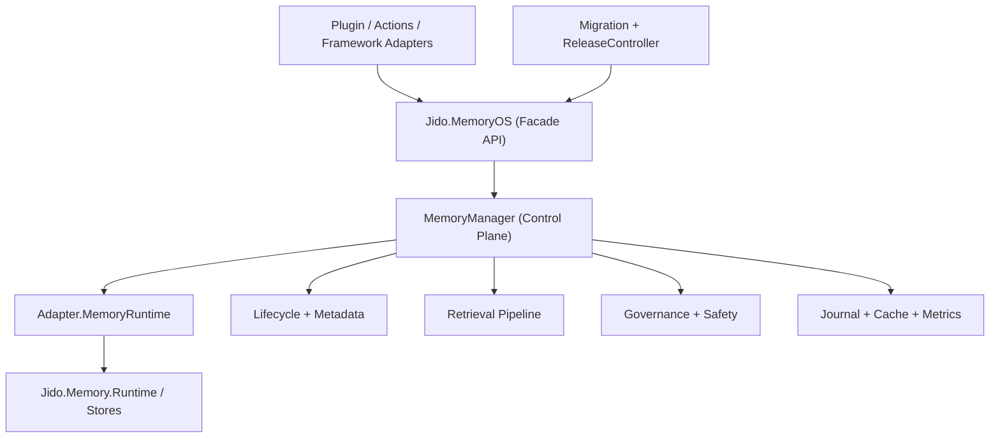

# 01 - Intended Goals and System Architecture

## Intended goals
`Jido.MemoryOS` is designed to deliver these outcomes:
- Reliable multi-tier memory for agents (`short`, `mid`, `long`)
- Deterministic lifecycle transitions and conflict-safe promotion
- High-signal retrieval with explainable ranking and context packing
- Governance controls suitable for multi-actor production systems
- Migration and rollout safety from legacy `jido_memory`-only setups

The conceptual model aligns with:
- [Memory OS of AI Agent (arXiv:2506.06326)](https://arxiv.org/abs/2506.06326)
- [BAI-LAB/MemoryOS](https://github.com/BAI-LAB/MemoryOS)

## Top-level architecture

## Core modules and responsibilities
- `Jido.MemoryOS`
  - Stable public API boundary.
  - Hides internal evolution behind a fixed interface.
- `Jido.MemoryOS.MemoryManager`
  - Central orchestrator for queueing, scheduling, retries, policy checks, auditing, and lifecycle operations.
- `Jido.MemoryOS.Adapter.MemoryRuntime`
  - Normalizes options and metadata and delegates storage operations to `Jido.Memory.Runtime`.
- `Jido.MemoryOS.Lifecycle` and `Jido.MemoryOS.Metadata`
  - Encodes lifecycle semantics and deterministic metadata transitions.
- Retrieval modules (`Query`, `Planner`, `Candidate`, `Ranker`, `ContextPack`)
  - Build plan -> fetch candidates -> rank -> package context -> explain decisions.
- Governance modules (`AccessPolicy`, `ApprovalToken`, `DataSafety`, `ErrorMapping`)
  - Enforce access control, gated actions, retention/redaction, and typed error contracts.
- Rollout modules (`Migration`, `ReleaseController`)
  - Support safe backfill, dual-run drift checks, cutover gating, and rollback paths.

## How architecture maps to goals
- Reliability goal: manager queueing + retries + dead letters + journaling.
- Retrieval quality goal: planner/ranker/context-pack pipeline with explainable traces.
- Safety goal: policy evaluation, approvals, masking, audit logs.
- Evolution goal: migration utilities and rollout controller with fallback and drift metrics.
