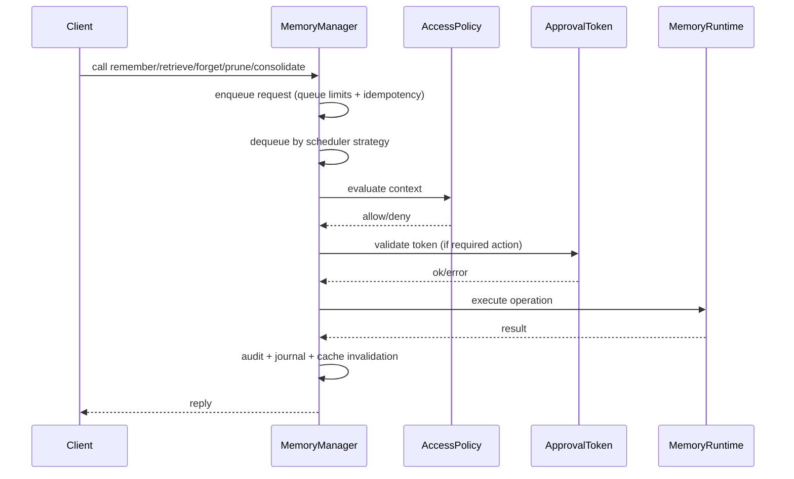

# 02 - Control Plane and Memory Manager Internals

## Why a control plane exists
Without a control plane, each API call would directly hit storage and duplicate logic for:
- Admission control
- Fair scheduling
- Retry/idempotency rules
- Policy and approval checks
- Auditing and cache invalidation

`Jido.MemoryOS.MemoryManager` centralizes these concerns.

## Request execution lifecycle

## Queueing and scheduling model
- Queueing is per-agent (`queue_by_agent`) with global `queue_depth`.
- Strategies:
  - `:round_robin`
  - `:fifo`
  - `:weighted_priority`
- Weighted strategy combines queue length and wait time to prevent starvation.
- Admission control supports:
  - hard caps (`queue_max_depth`, `queue_per_agent`)
  - adaptive throttling (`adaptive_throttle_*`)

## Reliability controls
- Retry policy for transient runtime failures (`retry_attempts`, `retry_backoff_ms`, `retry_jitter_ms`).
- Dead letters for failed ingests, capped by `dead_letter_limit`.
- Idempotency via `idempotency_key` and cached result reuse.
- Journal replay support for replay-safe operations on restart.

## Caching model
- Query-level retrieval cache with TTL and size cap.
- Invalidated on mutation operations:
  - agent-scoped invalidation for `remember/forget/prune/consolidate`
  - global invalidation for `policy_update`

## How this enables intended goals
- Throughput and stability improve via bounded queues and scheduler fairness.
- Operational predictability improves via consistent policy/audit gates before dispatch.
- Failure recovery improves via journal replay, retries, and dead-letter capture.
