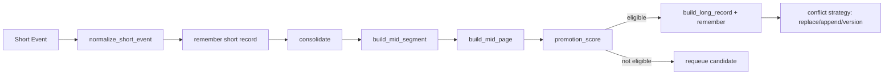

# 03 - Tiered Data Model and Lifecycle Mechanics

## Tier model
- `:short`
  - High-churn working memory from incoming events.
  - Tight caps and short TTL.
- `:mid`
  - Consolidated conversation structure as segments/pages.
  - Preserves lineage back to short-memory source IDs.
- `:long`
  - Durable semantic memory/facts with conflict strategy.

## Metadata contract
`Record.metadata["mem_os"]` is normalized by `Jido.MemoryOS.Metadata` and includes:
- `tier`
- `chain_id`, `segment_id`, `page_id`
- `heat`, `promotion_score`
- `last_accessed_at`
- `consolidation_version`
- `persona_keys`

## Lifecycle flow

## Consolidation mechanics
- Candidate sets:
  - `short_candidates`
  - `long_candidates`
- Consolidation reads selected short candidates, builds mid structures, then evaluates page promotion to long.
- Conflict handling tracks previous IDs and emits conflict entries into `last_conflicts`.

## Deterministic behavior decisions
- Stable IDs are derived for segments/pages/long records.
- Transition constraints are validated (`short -> mid -> long` unless explicitly relaxed).
- Promotion scoring combines heat, recurrence, and persona relevance.

## How this enables intended goals
- Tier semantics keep fast-changing context separate from durable memory.
- Lineage and versioning reduce silent corruption during promotion.
- Deterministic IDs/transitions make behavior testable and debuggable.
