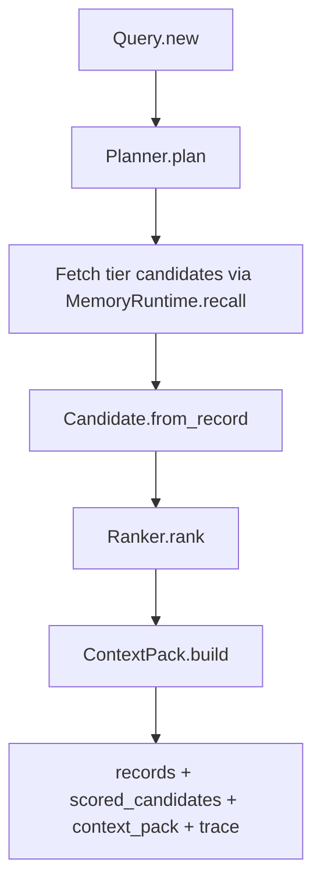

# 04 - Retrieval and Explainability Pipeline

## Query normalization
`Jido.MemoryOS.Query.new/2` normalizes retrieval payloads into a strict struct.

Important knobs:
- tier intent (`tier_mode`)
- semantic provider and timeout
- candidate fanout
- context token budget
- explain/debug flags

## Retrieval pipeline

## Ranking design
`Jido.MemoryOS.Retrieval.Ranker` computes `final_score` from:
- lexical score
- semantic score
- recency
- heat
- persona/topic matches
- tier bias

Semantic provider is pluggable through `Jido.MemoryOS.Retrieval.SemanticProvider`.
Fallback behavior degrades to lexical scoring on provider errors or timeout.

## Explainability payload
`explain_retrieval/3` returns:
- planner output and fanout choices
- semantic provider/degradation info
- scored candidates and excluded candidates
- selection rationale and feature weights
- token-bounded context pack and truncation state

## Token-aware context packaging
`ContextPack` groups selected entries by tier/topic and enforces `context_token_budget`.
If budget is tight, entries are truncated and the response marks `truncated: true`.

## How this enables intended goals
- Retrieval quality improves through hybrid signals and tier-aware planning.
- Explainability supports debugging, evals, and policy review.
- Token budgeting makes retrieval outputs practical for LLM turn assembly.
