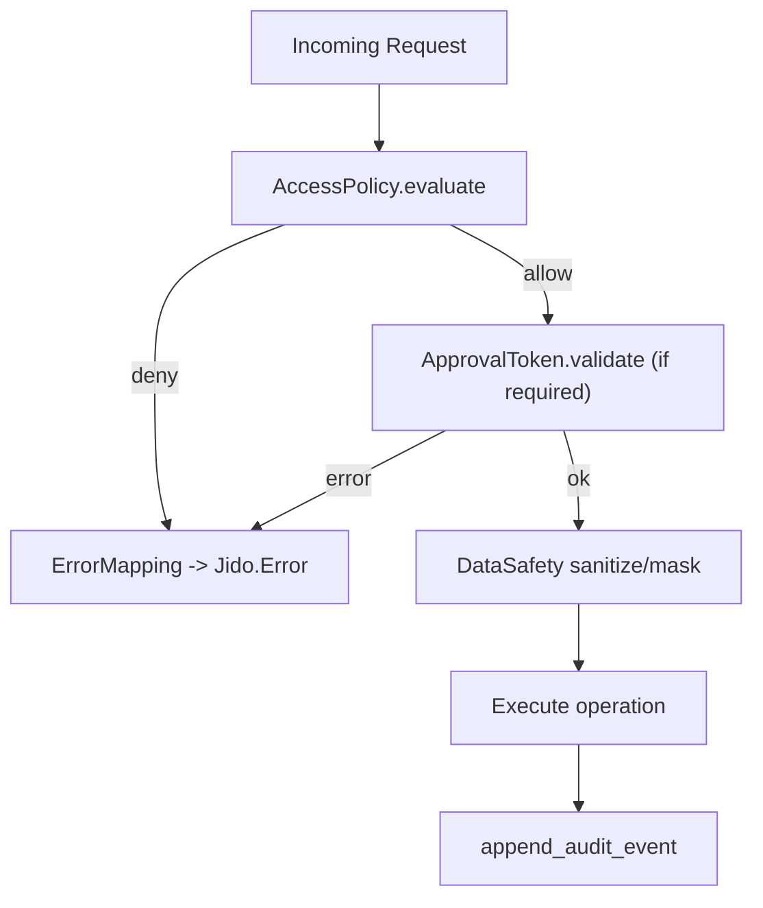

# 05 - Governance, Safety, and Observability

## Governance layers

## Access policy
`Jido.MemoryOS.AccessPolicy` evaluates action/tier/actor/group/role/target context.
Defaults are defensive:
- deny by default
- allow same actor
- optionally allow same group

## Approval token gating
`Jido.MemoryOS.ApprovalToken` supports time-bound, actor-bound, action-scoped approvals.
Typical gated actions:
- `:policy_update`
- `:forget`
- `:overwrite` (remember with explicit ID)

## Data safety
`Jido.MemoryOS.DataSafety` provides:
- retention checks (`allowed_classes`, `blocked_tags`, `max_ttl_ms`)
- redaction of common PII patterns
- role-based masking modes (`allow`, `mask`, `drop`) for retrieval outputs

## Error contract
`Jido.MemoryOS.ErrorMapping` converts internal reasons to typed `Jido.Error.*` values, preserving structured details (`code`, operation context, policy reason, etc).

## Observability artifacts
From `MemoryManager` state and APIs:
- `metrics/1`
- `audit_events/2`
- `journal_events/2`
- `dead_letters/1`
- `last_conflicts/1`

## How this enables intended goals
- Policy and approvals enforce least-privilege memory access.
- Retention and masking reduce accidental sensitive-data exposure.
- Typed errors + audit/journal traces support incident response and compliance review.
