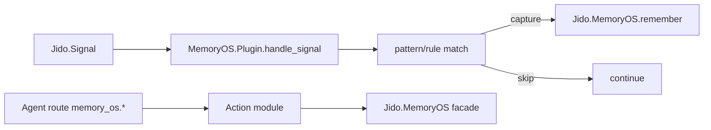

# 06 - Jido Integration and Extensibility Surfaces

## Integration surfaces
- Plugin: `Jido.MemoryOS.Plugin`
- Actions: `Jido.MemoryOS.Actions.Remember|Retrieve|Forget|Consolidate`
- Framework adapters:
  - `Jido.MemoryOS.FrameworkAdapter.SingleAgent`
  - `Jido.MemoryOS.FrameworkAdapter.MultiAgent`
  - `Jido.MemoryOS.FrameworkAdapter.ToolHeavy`

## Plugin routing and signal capture

## Why actions exist
Action wrappers provide schema-validated, pipeline-friendly access to facade operations and standardize result key placement in agent state.

## Framework adapter contract
`Jido.MemoryOS.FrameworkAdapter` defines:
- `pre_turn/3`
- `post_turn/3`
- `normalize_error/2`

Reference adapters map common orchestration styles:
- Single agent: simple retrieve-before, remember-after
- Multi-agent: participant fan-out/fan-in with optional partial success
- Tool-heavy: explicit tool-event memory capture with tool tags/status

## Extensibility points
- Semantic ranking provider behavior (`Retrieval.SemanticProvider`)
- Capture rules/patterns in plugin config
- Runtime option overlays from adapter payloads
- Compatibility mappers for legacy payload/query/result shapes (`Jido.MemoryOS.Compatibility`)

## How this enables intended goals
- Integration stays ergonomic for real Jido agents and workflows.
- Extensibility keeps core logic stable while allowing domain-specific retrieval/capture behavior.
- Legacy compatibility lowers migration cost for existing agents.
