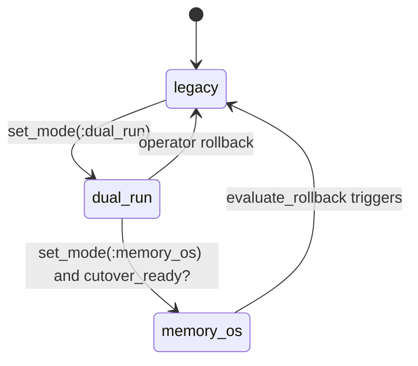

# 07 - Migration, Rollout, and Performance Engineering

## Migration model
`Jido.MemoryOS.Migration` supports:
- reading legacy records from `jido_memory`
- deterministic tier classification
- `mem_os` metadata backfill
- dry-run reporting and reconciliation

## Rollout controller model

`Jido.MemoryOS.ReleaseController` provides:
- modes: `:legacy`, `:dual_run`, `:memory_os`
- drift sampling between legacy and MemoryOS retrieval
- cutover gating with drift thresholds/min sample counts
- fallback behavior when MemoryOS path errors
- rollback checks from SLO snapshots

## Operational strategy
Recommended progression:
1. Validate config and retention/policy defaults.
2. Run migration dry run and inspect report.
3. Start `:dual_run` and collect drift samples.
4. Gate cutover using `cutover_ready?/1` and SLO checks.
5. Keep fallback enabled until stability period completes.

## Performance harness
`Jido.MemoryOS.Performance` provides repeatable benchmarks:
- `benchmark_ingestion/4`
- `benchmark_retrieval/4`
- `benchmark_mixed/4`
- `default_slos/0`

## How this enables intended goals
- Migration utilities preserve continuity from legacy systems.
- Rollout controls reduce blast radius during adoption.
- Benchmarks and SLOs create measurable confidence before full cutover.
